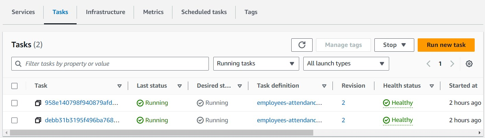

## Employee Clock APIs

### Introduction

The RESTful APIs are related to the attendance of the employees.

API Document is here: [API Doc](http://host-html-group.s3-website-ap-northeast-1.amazonaws.com)

### Usage

##### Prerequisites

- Node.js
- npm
- Docker

##### Steps

1. Clone the repo

```
git clone https://github.com/Coli-co/Employee_clock_api.git
```

2. Move into the folder

```
cd Employee_clock_api
```

3. Install packages

```
npm install
```

4. Create an `.env` file based on `.env.example`. Please remember to fill in the rest values.

```
cat .env.example >> .env
```

5. Execute the `start.sh` to run the application. you can send request to `http://localhost:3000` and add related endpoints.

```
chmod +x start.sh && sh start.sh
```

or

```
chmod +x start.sh && ./start.sh
```

6. Finally, to shut down the application, please run the command

  ```
  docker compose down
  ```

### My Cloud Deployment

- The application is also deployed on the cloud using AWS. Here is the DNS name for testing.
  ```
  http://employeealb-1404378238.ap-northeast-1.elb.amazonaws.com
  ```
- Here is my architecture:

  ```mermaid
  flowchart LR
  user --> |HTTP:80|B(Application\nLoad Balancer)
  B --> D
  B --> E
  subgraph ECS Cluster
  D[ECS Task 1]
  E[ECS Task 2]
  end
  D --> F[Database]
  E --> F
  ```
  

  
- The cloud services I used:
  - Application Load Balancer (ALB)
  - Elastic Container Registry
  - Elastic Container Service (ECS) + Fargate Launch Type (Serverless)
  - Elastic Compute Cloud (EC2) as database (PostgreSQL)
  - S3 for API Documentation (Redoc)
